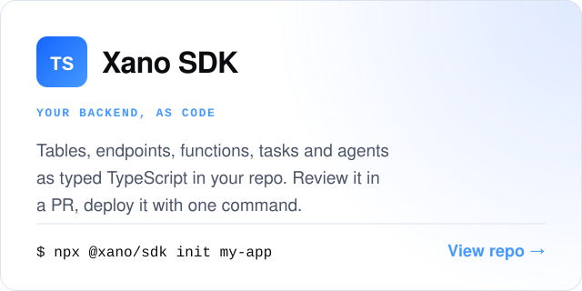
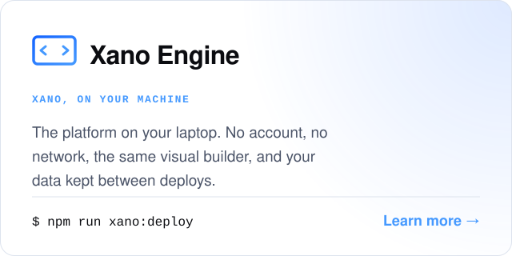

<picture>
  <source media="(prefers-color-scheme: dark)" srcset="assets/hero-dark.svg">
  
</picture>

<p align="center">
  <a href="https://github.com/xano-sdk/sdk"><b>Xano SDK</b></a> ·
  <a href="https://www.npmjs.com/package/@xano/sdk">npm</a> ·
  <a href="https://xano.com">xano.com</a> ·
  <a href="https://docs.xano.com">Docs</a> ·
  <a href="https://community.xano.com">Community</a> ·
  <a href="https://x.com/xanohq">X</a> ·
  <a href="https://www.youtube.com/@XanoHQ">YouTube</a>
</p>

[Xano](https://xano.com) is a hosted backend platform for systems that run in production. The
**Xano SDK**, the **Xano Engine** and **Xano Studio** let you, and the AI agents working for you,
build on it as code.

## What we build

<p>
  <a href="https://xano.com"><picture>
    <source media="(prefers-color-scheme: dark)" srcset="assets/card-xano-dark.svg">
    
  </picture></a>
  <a href="https://github.com/xano-sdk/sdk"><picture>
    <source media="(prefers-color-scheme: dark)" srcset="assets/card-sdk-dark.svg">
    
  </picture></a>
</p>
<p>
  <a href="https://github.com/xano-sdk/sdk#xano-on-your-machine"><picture>
    <source media="(prefers-color-scheme: dark)" srcset="assets/card-engine-dark.svg">
    
  </picture></a>
  <picture>
    <source media="(prefers-color-scheme: dark)" srcset="assets/card-studio-dark.svg">
    
  </picture>
</p>

## How it fits together

<picture>
  <source media="(prefers-color-scheme: dark)" srcset="assets/flow-dark.svg">
  
</picture>

## Try it

From an empty folder to a running full-stack app, with no sign-up:

```bash
npx @xano/sdk init my-app && cd my-app   # a TypeScript backend and a React or Svelte frontend
npm run xano:deploy                      # run the backend on the Xano Engine, on your machine
npm run dev                              # start the frontend, already wired to it
```

When it's ready to share, `npm run xano:deploy:ephemeral` puts the same code on a live URL on
Xano's cloud. The [Xano SDK README](https://github.com/xano-sdk/sdk) covers the rest.

## Modules

Add a whole feature to your backend with one import. Each module ships typed defs that you
register in your own workspace.

| Module | What you get |
| --- | --- |
| [`@xano-sdk/auth`](https://www.npmjs.com/package/@xano-sdk/auth) | Sign-up, login and `me` endpoints, with user, account and event log tables |
| [`@xano-sdk/password-reset`](https://www.npmjs.com/package/@xano-sdk/password-reset) | Single-use reset tokens, request and confirm endpoints, and the reset email |
| [`@xano-sdk/chatbot`](https://www.npmjs.com/package/@xano-sdk/chatbot) | Conversation and message tables, a Xano AI agent, and chat endpoints |
| [`@xano-sdk/vector`](https://github.com/xanots/vector) | Multimodal Gemini embeddings, document ingestion and semantic search |
| [`@xano-sdk/mcp-oauth`](https://www.npmjs.com/package/@xano-sdk/mcp-oauth) | Hosted OAuth sign-in and consent for the MCP servers you build |

## Get in touch

Found a bug or want a feature? [Open an issue on the SDK](https://github.com/xano-sdk/sdk/issues).
For everything else, visit the [Xano community](https://community.xano.com).

<sub>Security, compliance and uptime: [trust center](https://security.xano.com) · [status](https://status.xano.com)</sub>
